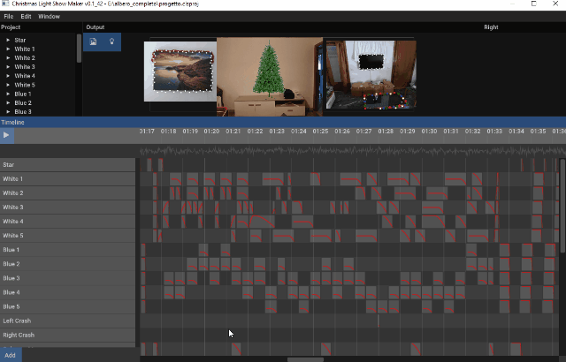

# WIP Light-Show-Maker [](https://ci.appveyor.com/project/aarcangeli/light-show-maker)
An arduino based light show editor

## Build from source

```bat
git submodule update --recursive --init
mkdir build && cd build
cmake -G "Ninja" ..
cmake --build .
```

### Main Project



### Example project:

[Highway To Hell.zip](https://github.com/aarcangeli/Light-Show-Maker/files/10135766/Highway.To.Hell.zip)

[
r/overlay?src0=https%3A%2F%2Fi.vimeocdn.com%2Fvideo%2F1548562110-bcc19dfbc546a0eadc5b123bddb130fdb00b06f9b0a3ba5ee4dcd8f740474382-d_1280x720&src1=https%3A%2F%2Ff.vimeocdn.com%2Fimages_v6%2Fshare%2Fplay_icon_overlay.png)](https://vimeo.com/771580294 "Final result")
